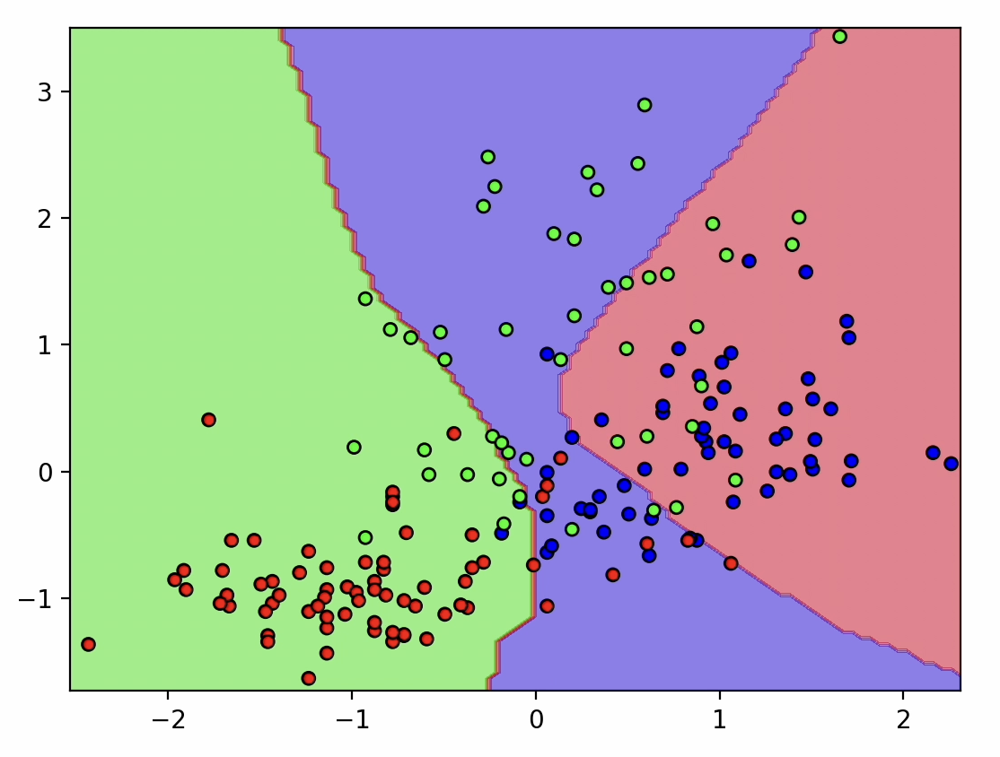
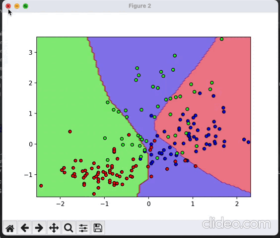
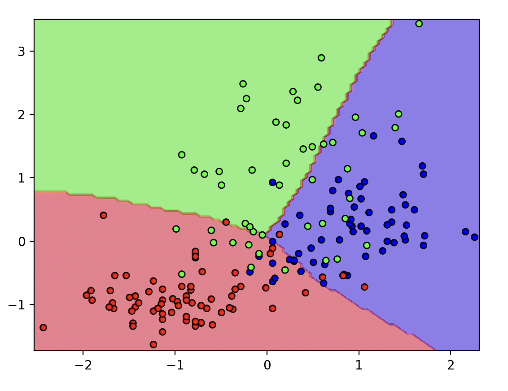

# Tipos de Machine Learning

# Ideia central de "aprendizagem de máquina"

A ideia central de "aprendizagem de máquina" é a capacidade dos algoritmos poderem prever resultados ou realizar tarefas sem serem explicitamente programados para isso.

Embora o algoritmo em si seja explicitamente programado e definido pelos desenvolvedores, no código não tem um conjunto de regras fixas e especificas codificadas diretamente, o algoritmo é projetado para "aprender" com os dados.

O [algoritmo de aprendizado por reforço](https://github.com/DeveloperArthur/machine-learning/blob/main/aprendizado-por-reforco/resolvendo-problema-com-aprendizagem.py) por exemplo

Ele não é explicitamente programado com regras de caminhos especificos como if-else para buscar o passageiro e deixar no local de destino, nós utilizamos Q-Learning para **simular** o processo de aprendizagem, utilizando as recompensas para ajustar os parâmetros.

# Definição

Uma boa definição para Machine Learning é "um punhado de estatística, regressão linear e probabilidade aplicada"

Um bom exemplo disso é: 
- [aprendizado-supervisionado/classificacao normal/classifica-caes-e-porcos/poc-classificacao-sem-naive-bayes.py](https://github.com/DeveloperArthur/machine-learning/blob/main/aprendizado-supervisionado/classificacao%20normal/classifica-caes-e-porcos/poc-classificacao-sem-naive-bayes.py)
- [aprendizado-nao-supervisionado/recomendacao/filtragem-colaborativa/recomendacao-com-impl-do-algoritmo-knn.py](https://github.com/DeveloperArthur/machine-learning/blob/main/aprendizado-nao-supervisionado/recomendacao/filtragem-colaborativa/recomendacao-com-impl-do-algoritmo-knn.py)

Estas são implementações que não utilizam modelos, se você olhar essas implementações verá que parecem muito mais uma extração e análise de dados, pois não há nenhum processo de "aprendizagem" por meio dos dados, são implementações simples.

Mas por mais que não haja um processo de treinamento e aprendizado nessas implementações, elas ainda são consideradas machine learning, pois são capazes de prever resultados com base em dados, sem serem explicitamente programadas para isso, e essa é a ideia central!

Essas implementações podem não ser tão eficientes, mas são consideradas machine learning ainda assim.

Exemplo de implementações que utilizam modelos:
- [aprendizado-supervisionado/classificacao normal/classifica-caes-e-porcos/poc-classificacao.py](https://github.com/DeveloperArthur/machine-learning/blob/main/aprendizado-supervisionado/classificacao%20normal/classifica-caes-e-porcos/poc-classificacao.py)
- [aprendizado-nao-supervisionado/recomendacao/filtragem-colaborativa/recomendando-com-modelo-knn.py](https://github.com/DeveloperArthur/machine-learning/blob/main/aprendizado-nao-supervisionado/recomendacao/filtragem-colaborativa/recomendando-com-modelo-knn.py)

Vale lembrar que as implementações dos modelos não fogem muito dessas implementações mais simples, por mais que as implementações dos modelos sejam mais complexas, Machine Learning é "um punhado de estatística, regressão linear e probabilidade aplicada" que tem a capaciade de prever resultados ou realizar tarefas sem ser explicitamente programados para isso.

## Curiosidade: 

Antes de "Inteligência Artificial", esse campo de estudo tinha o nome de Estatística Multivariada, como esse nome não tinha muito apelo comercial, o termo foi trocado para "Inteligência Artificial", que soava mais atraente, evocava uma aura de ficção científica etc

# Deep Learning

**Otimizando uma Rede Neural Perceptron Multicamadas com PyTorch**

Tínhamos dados de 3 classes de vinhos distribuídos no espaço, e precisávamos classifica-los corretamente,
inicialmente, a rede neural tinha uma fronteira de decisão aleatória, e a classificação estava totalmente incorreta:

Para melhorar a classificação, primeiro realizamos a padronização dos dados utilizando `StandardScaler`, e depois
otimizamos a rede, a otimização de redes neurais é um processo iterativo

Durante a otimização, calculamos a função de perda (`CrossEntropyLoss`) e aplicamos o otimizador `torch.optim.SGD`
(Descida do Gradiente Estocástica), a cada iteração executamos o Forward e Backpropagation para ajustar os pesos da rede

Iteramos 100 vezes, e cada passo de otimização ajudou a ajustar gradualmente a fronteira de decisão, isso resultou em uma
rede neural otimizada, capaz de classificar as 3 classes de vinhos corretamente

O GIF abaixo mostra a evolução do processo de otimização da rede neural, com o gráfico sendo plotado a cada 10 iterações:

Resultado final da rede otimizada:

Todo o código está presente em: https://github.com/DeveloperArthur/machine-learning/tree/main/deep-learning/treinando-redes-neurais/3-otimizacao-da-rede.py

# Referencias

a maioria dos algoritmos deste projeto foram implementados e aprendidos estudando através destes materiais:

